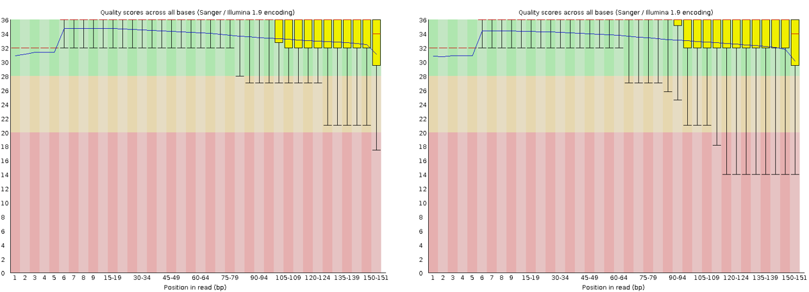
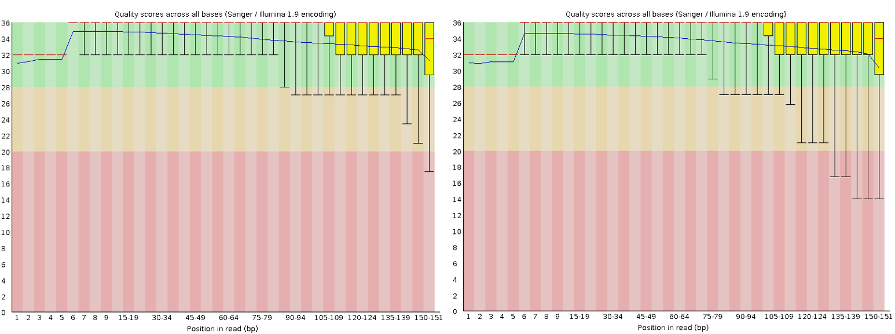

## Objectif :
Réaliser une analyse simple de données de reséquençage d'un génome bactérien. 
Les données sont issues de cet article : "Complete Genome Sequences of 13 Bacillus subtilis Soil Isolates for Studying Secondary Metabolite Diversity" (doi:10.1128/MRA.01406-19)  

# Données pour l'analyse :  
Génome de référence : NC_000964  

Fichier d'annotation .gff :  https://ftp.ncbi.nlm.nih.gov/genomes/all/GCF/000/009/045/GCF_000009045.1_ASM904v1/GCF_000009045.1_ASM904v1_genomic.gff.gz

Fichier séquences .fna :  https://ftp.ncbi.nlm.nih.gov/genomes/all/GCF/000/009/045/GCF_000009045.1_ASM904v1/GCF_000009045.1_ASM904v1_genomic.fna.gz


# Préparation de l'environnement de travail
On crée les différents dossiers qui contiendront les données de départ et les différentes données générées au cours de l'analyse.  
```{bash, eval=FALSE}
cd ~
mkdir Examen_final_M4-M5
cd Examen_final_M4-M5
mkdir GENOME_REF
mkdir FASTQ
mkdir QC
mkdir CLEANING
mkdir MAPPING
mkdir ANALYSIS
```
  
A l'aide de la commande "tree" on visulalise l'organisation des différents dossiers sous la forme d'une arborescence
```{bash, eval=FALSE} 
tree

-- Examen_final_M4-M5
|   |-- ANALYSIS
|   |-- CLEANING
|   |-- FASTQ
|   |-- GENOME_REF
|   |-- MAPPING
|   |-- QC
```

# Chargement des données pour le génome de référence  

Les données seront chargées dans le répertoire "GENOME_REF"
```{bash, eval=FALSE}
cd ~/Examen_final_M4-M5/GENOME_REF
wget https://ftp.ncbi.nlm.nih.gov/genomes/all/GCF/000/009/045/GCF_000009045.1_ASM904v1/GCF_000009045.1_ASM904v1_genomic.gff.gz
wget https://ftp.ncbi.nlm.nih.gov/genomes/all/GCF/000/009/045/GCF_000009045.1_ASM904v1/GCF_000009045.1_ASM904v1_genomic.fna.gz
```

On vérifie les données chargées:
```{bash, eval=FALSE}
ls -ltrh

total 1.7M
-rw-rw-r-- 1 vclouet vclouet 1.2M Sep 21  2018 GCF_000009045.1_ASM904v1_genomic.fna.gz
-rw-rw-r-- 1 vclouet vclouet 509K Dec 17  2019 GCF_000009045.1_ASM904v1_genomic.gff.gz
```

# Chargement des reads fastq SRR10390685 

Les données seront chargées dans le répertoire "FASTQ".  

On recherche les fichiers sur le site de l'ENA https://www.ebi.ac.uk/ena/ en tappant la référence SRR10390685 dans la barre de recherche et on récupère les liens de téléchargement  
```{bash, eval=FALSE}
cd ~/Examen_final_M4-M5/FASTQ
wget ftp://ftp.sra.ebi.ac.uk/vol1/fastq/SRR103/085/SRR10390685/SRR10390685_1.fastq.gz
wget ftp://ftp.sra.ebi.ac.uk/vol1/fastq/SRR103/085/SRR10390685/SRR10390685_2.fastq.gz
```

On vérifie les données chargées:
```{bash, eval=FALSE}
ls -ltrh

total 1.2G
-rw-rw-r-- 1 vclouet vclouet 579M Jun 30 11:56 SRR10390685_1.fastq.gz
-rw-rw-r-- 1 vclouet vclouet 588M Jun 30 11:56 SRR10390685_2.fastq.gz
```

# Analyse qualité des reads avec fastQC
On va regarder la qualité des séquences contenues dans les fichiers SRR10390685_1.fastq.gz et SRR10390685_2.fastq.gz  
```{bash, eval=FALSE}
cd ~/Examen_final_M4-M5
module load fastqc/0.11.8
srun --cpus-per-task 8 fastqc FASTQ/SRR10390685_1.fastq.gz -o QC/ -t 8
srun --cpus-per-task 8 fastqc FASTQ/SRR10390685_2.fastq.gz -o QC/ -t 8
```

On vérifie les nouveaux fichiers obtenus:
```{bash, eval=FALSE}
ls -ltrh ~/Examen_final_M4-M5/QC

total 1.7M
-rw-rw-r-- 1 vclouet vclouet 291K Jun 30 12:01 SRR10390685_1_fastqc.zip
-rw-rw-r-- 1 vclouet vclouet 548K Jun 30 12:01 SRR10390685_1_fastqc.html
-rw-rw-r-- 1 vclouet vclouet 312K Jun 30 12:03 SRR10390685_2_fastqc.zip
-rw-rw-r-- 1 vclouet vclouet 561K Jun 30 12:03 SRR10390685_2_fastqc.html
```


```{r, fig.align="center", out.width="100%", echo=FALSE}

```

Le fichier SRR10390685_1.fastq.gz contient 7 066 055 séquences qui vont de 35 à 151 pb avec une moyenne de 149 pb. Le qualité est plutôt bonne, la majorité des séquences à un QC > 30 par contre il y a une sur-représentation de séquences poly N.  
Le fichier SRR10390685_2.fastq.gz contient également 7 066 055 séquences qui vont de 130 à 151 pb avec une moyenne de 150 pb. Le qualité est plutôt bonne (mais un peu moins bonne par rapport au fichier 1), la majorité des séquences à un QC > 30  par contre il y a une sur-représentation de séquences poly G et il semble qu'il reste quelques traces d'adaptateurs Illumina.  

# Profondeur de séquençage

On calcul la profondeur de séquençage selon cette formule :  
**Profondeur = N * L/G**  
Avec:  
N = Nombres de reads  
L = tailles des reads  
G = taille du génome  

Nous avons 7 066 055 reads pairés qui ont une taille moyenne de 149 pb pour les reads 1 et 150 pb pour les reads 2.
Le génome de NC_000964 fait 4 215 606 pb  

Profondeur = (7 066 055 * 149 + 7 066 055 * 150)/4 215 606  
**Profondeur = 501.17**

# Nettoyage des reads avec fastp

Afin d'améliorer la qualité des reads, on utilise fastp avec les paramètres suivants:  
- 40% des bases avec une qualité> = 20  
- taille minimale des reads rognés de 100  
- on élimine les séquences polyG et polyN  
```{bash, eval=FALSE}
module load fastp/0.20.0
cd ~/Examen_final_M4-M5
srun --cpus-per-task 8 fastp \
--in1 FASTQ/SRR10390685_1.fastq.gz \
--in2 FASTQ/SRR10390685_2.fastq.gz \
--length_required 100 \
--qualified_quality_phred 20 \
--unqualified_percent_limit 40 \
--trim_poly_g \
--trim_poly_x \
--out1 CLEANING/SRR10390685_1.cleaned_filtered.fastq.gz \
--out2 CLEANING/SRR10390685_2.cleaned_filtered.fastq.gz \
--unpaired1 CLEANING/SRR10390685_1_singles.fastq.gz \
--unpaired2 CLEANING/SRR10390685_2_singles.fastq.gz \
--json CLEANING/fastp.json \
--html CLEANING/fastp.html
```

On vérifie les nouveaux fichiers obtenus:
```{bash, eval=FALSE}
ls -ltrh ~/Examen_final_M4-M5/CLEANING

total 1.2G
-rw-rw-r-- 1 vclouet vclouet 135K Jun 30 13:23 fastp.json
-rw-rw-r-- 1 vclouet vclouet 479K Jun 30 13:23 fastp.html
-rw-rw-r-- 1 vclouet vclouet 1.5M Jun 30 13:23 SRR10390685_2_singles.fastq.gz
-rw-rw-r-- 1 vclouet vclouet 604M Jun 30 13:23 SRR10390685_2.cleaned_filtered.fastq.gz
-rw-rw-r-- 1 vclouet vclouet  15M Jun 30 13:23 SRR10390685_1_singles.fastq.gz
-rw-rw-r-- 1 vclouet vclouet 597M Jun 30 13:23 SRR10390685_1.cleaned_filtered.fastq.gz
```

résultats:
```{bash, eval=FALSE}
Read1 before filtering:
total reads: 7066055
total bases: 1056334498
Q20 bases: 989425011(93.6659%)
Q30 bases: 950850058(90.0141%)

Read2 before filtering:
total reads: 7066055
total bases: 1062807718
Q20 bases: 975887037(91.8216%)
Q30 bases: 933776181(87.8594%)

Read1 after filtering:
total reads: 6854706
total bases: 1026630299
Q20 bases: 967146478(94.2059%)
Q30 bases: 930618007(90.6478%)

Read2 aftering filtering:
total reads: 6854706
total bases: 1026645215
Q20 bases: 954490297(92.9718%)
Q30 bases: 915166275(89.1414%)

Filtering result:
reads passed filter: 13709412
reads failed due to low quality: 365628
reads failed due to too many N: 4116
reads failed due to too short: 52954
reads with adapter trimmed: 357344
bases trimmed due to adapters: 5464408
reads with polyX in 3' end: 55776
bases trimmed in polyX tail: 503450

Duplication rate: 1.17555%

Insert size peak (evaluated by paired-end reads): 264
```


Après analyse des résultats après nettoyage et filtrage fastp, on observe une diminution du nombre de reads avec un total de 6 854 706 reads pour chaque fichiers (7 066 055 au départ) soit 97% des reads de départ.
On a donc 3% des reads qui n'ont pas passé le filtre qualité des paramètres utilisés dans fastp dont, si on regarde en détail, 2.6% qui ont été éliminés à cause d'une qualité trop faible, 0.03% parce qu'ils avaient trop de N et 0.37% car leur taille était inférieur à la taille minimale entrée en paramètre (ici 100 pb).

# Analyse qualité des reads nettoyés et filtrés avec fastQC
On va regarder la qualité des séquences des fichiers SRR10390685_1.cleaned_filtered.fastq.gz et SRR10390685_2.cleaned_filtered.fastq.gz  
```{bash, eval=FALSE}
cd ~/Examen_final_M4-M5
module load fastqc/0.11.8
srun --cpus-per-task 8 fastqc CLEANING/SRR10390685_1.cleaned_filtered.fastq.gz -o QC/ -t 8
srun --cpus-per-task 8 fastqc CLEANING/SRR10390685_2.cleaned_filtered.fastq.gz -o QC/ -t 8
```

On vérifie les nouveaux fichiers obtenus:
```{bash, eval=FALSE}
ls -ltrh ~/Examen_final_M4-M5/QC

total 2.8M
-rw-rw-r-- 1 vclouet vclouet 291K Jun 30 12:01 SRR10390685_1_fastqc.zip
-rw-rw-r-- 1 vclouet vclouet 548K Jun 30 12:01 SRR10390685_1_fastqc.html
-rw-rw-r-- 1 vclouet vclouet 312K Jun 30 12:03 SRR10390685_2_fastqc.zip
-rw-rw-r-- 1 vclouet vclouet 561K Jun 30 12:03 SRR10390685_2_fastqc.html
-rw-rw-r-- 1 vclouet vclouet 540K Jun 30 13:41 SRR10390685_1.cleaned_filtered_fastqc.html
-rw-rw-r-- 1 vclouet vclouet 542K Jun 30 13:42 SRR10390685_2.cleaned_filtered_fastqc.html
```

```{r, fig.align="center", out.width="100%", echo=FALSE}

```

# Alignement des reads contre le génome de reférence

On va maintenant aligner les reads filtrés sur le génome de référence NC_000964 disponible dans le répertoire "GENOME_REF". Pour cela on utilise BWA.  

Une première étape consiste à indexer le génome de référence avec **bwa index**:
```{bash, eval=FALSE}
module load bwa/0.7.17
cd ~/Examen_final_M4-M5/GENOME_REF
srun bwa index GCF_000009045.1_ASM904v1_genomic.fna.gz
```

On vérifie les nouveaux fichiers obtenus:
```{bash, eval=FALSE}
ls -ltrh

total 8.8M
-rw-rw-r-- 1 vclouet vclouet 1.2M Sep 21  2018 GCF_000009045.1_ASM904v1_genomic.fna.gz
-rw-rw-r-- 1 vclouet vclouet 509K Dec 17  2019 GCF_000009045.1_ASM904v1_genomic.gff.gz
-rw-rw-r-- 1 vclouet vclouet 4.1M Jun 30 13:29 GCF_000009045.1_ASM904v1_genomic.fna.gz.bwt
-rw-rw-r-- 1 vclouet vclouet 1.1M Jun 30 13:29 GCF_000009045.1_ASM904v1_genomic.fna.gz.pac
-rw-rw-r-- 1 vclouet vclouet   98 Jun 30 13:29 GCF_000009045.1_ASM904v1_genomic.fna.gz.ann
-rw-rw-r-- 1 vclouet vclouet   12 Jun 30 13:29 GCF_000009045.1_ASM904v1_genomic.fna.gz.amb
-rw-rw-r-- 1 vclouet vclouet 2.1M Jun 30 13:29 GCF_000009045.1_ASM904v1_genomic.fna.gz.sa
```

On lance ensuite la commande de "mapping" **bwa mem** avec la séquence du génome de référence et les 2 fichiers de séquences filtrées et un nombre de thread (-t) de 32. On pipe les résultats de **bwa mem** dans **samtools view** et on redirige la sortie dans un fichier SRR10390685.bam
On sollicite 33 cpu per tasks : 32 pour "bwa mem" et 1 pour "samtools view"
```{bash, eval=FALSE}
cd ~/Examen_final_M4-M5
module load bwa/0.7.17
module load samtools/1.9
srun --cpus-per-task=33 \
bwa mem GENOME_REF/GCF_000009045.1_ASM904v1_genomic.fna.gz \ 
CLEANING/SRR10390685_1.cleaned_filtered.fastq.gz \ 
CLEANING/SRR10390685_2.cleaned_filtered.fastq.gz \
-t 32 \
| \
samtools view -hbS - > MAPPING/SRR10390685.bam
```

On vérifie le nouveau fichier obtenu:
```{bash, eval=FALSE}
cd MAPPING
ls -ltrh

total 1.5G
-rw-rw-r-- 1 vclouet vclouet 1.5G Jun 30 15:24 SRR10390685.bam
```


On visualize le fichier .bam:
```{bash, eval=FALSE}
samtools view SRR10390685.bam | less -S
```


Quelques infos sur les résultats de mapping:
```{bash, eval=FALSE}
samtools flagstat SRR10390685.bam

13727924 + 0 in total (QC-passed reads + QC-failed reads)
0 + 0 secondary
18512 + 0 supplementary
0 + 0 duplicates
12983242 + 0 mapped (94.58% : N/A)
13709412 + 0 paired in sequencing
6854706 + 0 read1
6854706 + 0 read2
12908648 + 0 properly paired (94.16% : N/A)
12931804 + 0 with itself and mate mapped
32926 + 0 singletons (0.24% : N/A)
0 + 0 with mate mapped to a different chr
0 + 0 with mate mapped to a different chr (mapQ>=5)
```
On voit que 94.58% des reads ont été assignés à une région du génome et que 94.16% des reads ont bien été pairés ce qui correspond à 0.24% de singletons

12 931 804 ont à la fois été pairés et assignés sur le génome

**Quel est le % de reads pairés alignés ?**
Il y a donc 12 931 804 reads pairés alignés qui correspondent à 94.33% des 13 709 412 reads pairés de départ.

**Extraire dans un fichier BAM les reads chevauchant à au moins 50% le gène trmNF**

On va chercher dans le fichier d'annotation gff la position du gène **trmNF** en faisant un grep dans le fichier gff d'annotation du génome (extrait les lignes où le nom du gène est présent) puis on utilise "awk" pour ne conserver que la ligne dont la 3e colonne contient "gene". 
```{bash, eval=FALSE}
cd ~/Examen_final_M4-M5/GENOME_REF
zgrep trmNF GCF_000009045.1_ASM904v1_genomic.gff.gz \
| awk '$3=="gene"' \
> trmNF_gene.gff
```

Dans le fichier **SRR10390685.bam** on a toutes les postions sur le génome des reads mappés.
Dans le fichier **trmNF_gene.gff** on a la position du gène trmNF qui nous intéresse.
Nous allons récupérer dans le fichier bam uniquement les positions pour lesquelles les reads chevauchent au moins pour moitié sur le gène **trmNF** .
On utilise **bedtools intersect** avec l'option -abam : chaque alignement BAM du fichier -a est comparé à -b à la recherche de chevauchements et l'option -f 0.50 : le chevauchement minimum requis en fraction de B (fichier gff) demandé est 50%

```{bash, eval=FALSE}
module load bedtools/2.27.1
cd ~/Examen_final_M4-M5/ANALYSIS
srun samtools view -b ~/Examen_final_M4-M5/MAPPING/SRR10390685.bam| \
bedtools intersect -abam \
stdin -b ~/Examen_final_M4-M5/GENOME_REF/trmNF_gene.gff \
-f 0.50 \
> Intersect_trmNF_gene.bam
```

On vérifie le nouveau fichier obtenu **Intersect_trmNF_gene.bam**:
```{bash, eval=FALSE}
ls -ltrh

total 176K
-rw-rw-r-- 1 vclouet vclouet 176K Jul  3 09:59 Intersect_trmNF_gene.bam
```

On visualise le contenu du fichier **Intersect_trmNF_gene.bam**
```{bash, eval=FALSE}
samtools view Intersect_trmNF_gene.bam | less -S
```

On regarde le nombre de lignes dans le fichier **Intersect_trmNF_gene.bam** qui correspond au nombre de reads chevauchant à au moins 50% le gène trmNF:
```{bash, eval=FALSE}
samtools view Intersect_trmNF_gene.bam | wc -l

2839
```
